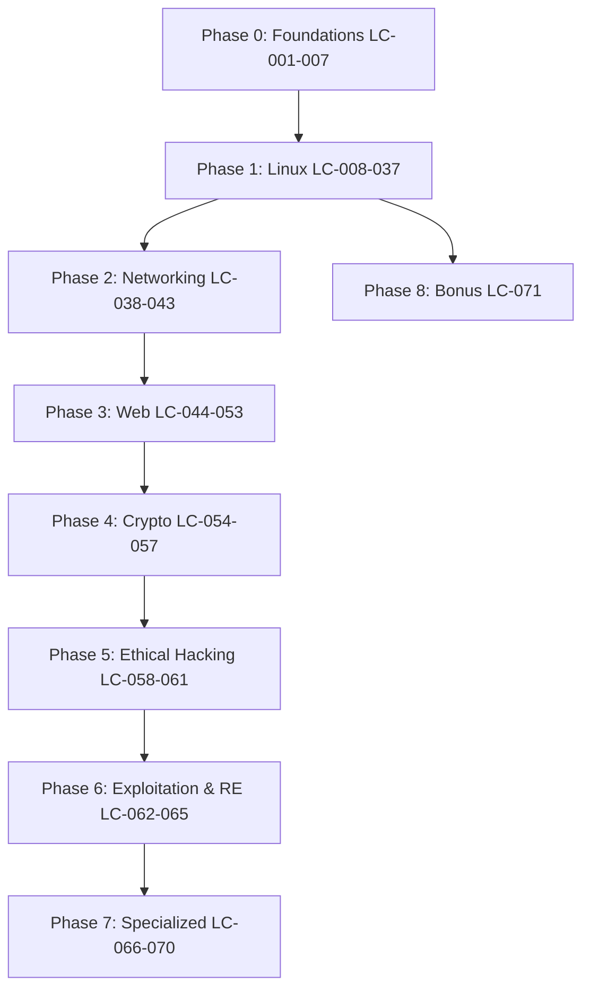

# ??? LearnCybersecurity — Master Roadmap

> **71 Lessons · 9 Phases · Trilingual (ID / EN / JP)**  
> ?? Books: `~/Documents/Books/` — see **[BOOKS.md](BOOKS.md)** for full catalog  
> ?? Author: [kodoktheGr3at](https://github.com/Kodokthegr3at) | ?? 2026

---

## How to Use This Roadmap

1. **Follow order `LC-001` ? `LC-071`** unless you already mastered a phase.
2. Each file contains a **Curriculum ID block** at the top (search `LC-CURRICULUM`).
3. Read the **Book map** line, then open the PDF chapters listed in [BOOKS.md](BOOKS.md).
4. Complete **Security Notes** and **Cheatsheet** sections hands-on in a lab VM.
5. **Estimated total:** ~280–350 hours for full mastery.



---

## Phase 0 — Foundations & Computing Basics

**Goal:** Expression logic, version control, Windows/Linux/macOS filesystem literacy.  
**Books:** King (*C Programming*), Sweigart (*Automate the Boring Stuff*), Friedl (*Mastering RegEx*)

| ID | # | File | Topic | Level | Hours |
|:---|---|:-----|:------|:------|:------|
| **LC-001** | 0.1 | [basics/Expression.md](basics/Expression.md) | Arithmetic, boolean, regex, bitwise, cast — injection surfaces | Beginner | 2–3h |
| **LC-002** | 0.2 | [basics/Git — Version Control System.md](basics/Git%20%E2%80%94%20Version%20Control%20System.md) | Git workflow, branching, secret scanning in history | Beginner | 3–4h |
| **LC-003** | 0.3 | [basics/PowerShell.md](basics/PowerShell.md) | Cmdlets, object pipeline, Windows post-exploitation recon | Beginner | 4–5h |
| **LC-004** | 0.4 | [basics/Windows Command Prompt (cmd.exe).md](basics/Windows%20Command%20Prompt%20%28cmd.exe%29.md) | CMD utilities, batch, legacy Windows enum | Beginner | 3–4h |
| **LC-005** | 0.5 | [basics/OperatingSystem/Linux File System.md](basics/OperatingSystem/Linux%20File%20System.md) | FHS, `/proc`, `/sys`, device nodes, privilege paths | Beginner | 5–6h |
| **LC-006** | 0.6 | [basics/OperatingSystem/Windows File System.md](basics/OperatingSystem/Windows%20File%20System.md) | NTFS, ADS, System32, Registry hives | Beginner | 5–6h |
| **LC-007** | 0.7 | [basics/OperatingSystem/macOS File System.md](basics/OperatingSystem/macOS%20File%20System.md) | APFS, domains, TCC/SIP context | Beginner | 4–5h |

**Technical anchor (from books):**
- *King Ch.2–5:* operator precedence, integer width, overflow — foundation for binary exploitation later.
- *Ward Ch.3–5:* why Linux is a single directory tree; how `/proc` exposes kernel state to defenders and attackers.
- *Friedl Ch.1–4:* regex engines — required before LC-020 and all log/SIEM work.

---

## Phase 1 — Linux Fundamentals (HTB Academy Module 18)

**Goal:** Shell mastery, workflow, system admin, networking on host, hardening.  
**Books:** Ward (*How Linux Works*), Shotts (*The Linux Command Line*), Benvenuti (*Linux Network Internals*), Stallings (*Network Security*)

| ID | # | Section | File |
|:---|---|:--------|:-----|
| **LC-008** | 1.1 | Introduction | [01. Linux Structure](linux/01.%20Linux%20Structure%20%E2%80%94%20History,%20Philosophy,%20Architecture%20&%20Filesystem.md) |
| **LC-009** | 1.2 | Introduction | [02. Linux Distributions](linux/02.%20Linux%20Distributions%20%28Distros%29.md) |
| **LC-010** | 1.3 | Introduction | [03. Introduction to Shell](linux/03.%20Introduction%20to%20Shell.md) |
| **LC-011** | 2.1 | The Shell | [04. Prompt Description](linux/04.%20Prompt%20Description%20&%20PS1%20Customization.md) |
| **LC-012** | 2.2 | The Shell | [05. Getting Help](linux/05.%20Getting%20Help%20%E2%80%94%20man,%20--help,%20apropos.md) |
| **LC-013** | 2.3 | The Shell | [06. System Information](linux/06.%20System%20Information%20%E2%80%94%20Kernel,%20Hardware%20&%20Environment.md) |
| **LC-014** | 3.1 | Workflow | [07. Navigation](linux/07.%20Navigation%20%E2%80%94%20Moving%20Through%20the%20Linux%20Filesystem.md) |
| **LC-015** | 3.2 | Workflow | [08. Working with Files](linux/08.%20Working%20with%20Files%20&%20Directories.md) |
| **LC-016** | 3.3 | Workflow | [09. Editing Files](linux/09.%20Editing%20Files%20%E2%80%94%20Nano%20&%20Vim.md) |
| **LC-017** | 3.4 | Workflow | [10. Find Files](linux/10.%20Find%20Files%20&%20Directories.md) |
| **LC-018** | 3.5 | Workflow | [11. File Descriptors](linux/11.%20File%20Descriptors%20&%20Redirections.md) |
| **LC-019** | 3.6 | Workflow | [12. Filter Contents](linux/12.%20Filter%20Contents%20%E2%80%94%20Output%20Filtering%20&%20Text%20Processing.md) |
| **LC-020** | 3.7 | Workflow | [13. Regular Expressions](linux/13.%20Regular%20Expressions%20%28RegEx%29.md) |
| **LC-021** | 3.8 | Workflow | [14. Permission Management](linux/14.%20Permission%20Management.md) |
| **LC-022** | 4.1 | System Mgmt | [15. User Management](linux/15.%20User%20Management.md) |
| **LC-023** | 4.2 | System Mgmt | [16. Package Management](linux/16.%20Package%20Management.md) |
| **LC-024** | 4.3 | System Mgmt | [17. Service and Process Management](linux/17.%20Service%20and%20Process%20Management.md) |
| **LC-025** | 4.4 | System Mgmt | [18. Task Scheduling](linux/18.%20Task%20Scheduling.md) |
| **LC-026** | 4.5 | System Mgmt | [19. Network Services](linux/19.%20Network%20Services.md) |
| **LC-027** | 4.6 | System Mgmt | [20. Working with Web Services](linux/20.%20Working%20with%20Web%20Services.md) |
| **LC-028** | 4.7 | System Mgmt | [21. Backup and Restore](linux/21.%20Backup%20and%20Restore.md) |
| **LC-029** | 4.8 | System Mgmt | [22. File System Management](linux/22.%20File%20System%20Management.md) |
| **LC-030** | 4.9 | System Mgmt | [23. Containerization](linux/23.%20Containerization.md) |
| **LC-031** | 5.1 | Linux Networking | [24. Interfaces & Routing](linux/24.%20Linux%20Networking%20%E2%80%94%20Interfaces%20&%20Routing.md) |
| **LC-032** | 5.2 | Linux Networking | [25. Diagnostics & Packet Analysis](linux/25.%20Linux%20Networking%20%E2%80%94%20Diagnostics%20&%20Packet%20Analysis.md) |
| **LC-033** | 6.1 | Hardening | [26. Linux Security Theory](linux/26.%20Linux%20Security%20%E2%80%94%20Threat%20Model%20&%20Hardening%20Theory.md) |
| **LC-034** | 6.2 | Hardening | [27. Firewall Setup](linux/27.%20Firewall%20Setup.md) |
| **LC-035** | 6.3 | Hardening | [28. System Logs](linux/28.%20System%20Logs.md) |
| **LC-036** | 7.1 | Solaris | [29. Solaris vs Linux](linux/29.%20Solaris%20%E2%80%94%20Linux%20Distributions%20vs%20Solaris.md) |
| **LC-037** | 8.1 | Tips | [30. Bash Shortcuts](linux/30.%20Shortcuts%20%E2%80%94%20Bash%20Tips%20&%20Tricks.md) |

**Technical anchor:** *Shotts* builds CLI fluency; *Ward* explains **why** (kernel, init, storage). PrivEsc hunting starts at LC-017 (SUID) and LC-021 (permissions).

---

## Phase 2 — Computer Networking & Protocols

**Goal:** OSI/TCP-IP, addressing, DNS, ARP/MITM, wireless.  
**Books:** Kurose & Ross, Stallings, Benvenuti, Stevens, Gast

| ID | # | File | Topic | Hours |
|:---|---|:-----|:------|:------|
| **LC-038** | 2.1 | [networking/OSI Modelling.md](networking/OSI%20Modelling.md) | 7-layer model, encapsulation, per-layer attacks | 6–8h |
| **LC-039** | 2.2 | [networking/TCP-IP Architecture & Socket Programming.md](networking/TCP-IP%20Architecture%20&%20Socket%20Programming.md) | 4-layer model, 3-way handshake, sockets | 5–6h |
| **LC-040** | 2.3 | [networking/IP Addressing & Subnetting.md](networking/IP%20Addressing%20&%20Subnetting.md) | CIDR, VLSM, NAT, routing math | 4–5h |
| **LC-041** | 2.4 | [networking/DNS & Domain Name System Security.md](networking/DNS%20&%20Domain%20Name%20System%20Security.md) | DNS hierarchy, AXFR, cache poisoning, DoH | 4h |
| **LC-042** | 2.5 | [networking/ARP & Local Network Attacks.md](networking/ARP%20&%20Local%20Network%20Attacks.md) | ARP spoofing, MITM, DAI defense | 4h |
| **LC-043** | 2.6 | [networking/Wireless 802.11 Security & Attacks.md](networking/Wireless%20802.11%20Security%20&%20Attacks.md) | WPA2/3, 4-way handshake, PMKID | 5h |

**Technical anchor:** *Kurose & Ross Ch.1–5* — protocol timing, loss, RTT; essential for understanding scanning (LC-059) and packet capture (LC-032).

---

## Phase 3 — Web Protocols & Application Security

**Goal:** HTTP deep dive + OWASP-class vulnerabilities.  
**Books:** Stuttard & Pinto (*WAHH*), Zalewski (*Tangled Web*)

| ID | # | Track | File |
|:---|---|:------|:-----|
| **LC-044** | 3.1 | HTTP | [web/HTTP/1. HTTP & cURL.md](web/HTTP/1.%20HTTP%20&%20cURL.md) |
| **LC-045** | 3.2 | HTTP | [web/HTTP/2. HTTP Requests, Responses & Status Codes.md](web/HTTP/2.%20HTTP%20Requests,%20Responses%20&%20Status%20Codes.md) |
| **LC-046** | 3.3 | HTTP | [web/HTTP/3. HTTP Headers & Security Headers.md](web/HTTP/3.%20HTTP%20Headers%20&%20Security%20Headers.md) |
| **LC-047** | 3.4 | Vuln | [web/Vulnerabilities/1. SQL Injection (SQLi).md](web/Vulnerabilities/1.%20SQL%20Injection%20%28SQLi%29.md) |
| **LC-048** | 3.5 | Vuln | [web/Vulnerabilities/2. Cross-Site Scripting (XSS).md](web/Vulnerabilities/2.%20Cross-Site%20Scripting%20%28XSS%29.md) |
| **LC-049** | 3.6 | Vuln | [web/Vulnerabilities/3. Cross-Site Request Forgery (CSRF).md](web/Vulnerabilities/3.%20Cross-Site%20Request%20Forgery%20%28CSRF%29.md) |
| **LC-050** | 3.7 | Vuln | [web/Vulnerabilities/4. Server-Side Request Forgery (SSRF).md](web/Vulnerabilities/4.%20Server-Side%20Request%20Forgery%20%28SSRF%29.md) |
| **LC-051** | 3.8 | Vuln | [web/Vulnerabilities/5. Command Injection & File Inclusion (LFI & RFI).md](web/Vulnerabilities/5.%20Command%20Injection%20&%20File%20Inclusion%20%28LFI%20&%20RFI%29.md) |
| **LC-052** | 3.9 | Vuln | [web/Vulnerabilities/6. File Upload Vulnerabilities & Web Shells.md](web/Vulnerabilities/6.%20File%20Upload%20Vulnerabilities%20&%20Web%20Shells.md) |
| **LC-053** | 3.10 | Vuln | [web/Vulnerabilities/7. Authentication, Session & JWT Attacks.md](web/Vulnerabilities/7.%20Authentication,%20Session%20&%20JWT%20Attacks.md) |

**Study order:** HTTP 1?3, then SQLi ? XSS ? CSRF ? SSRF ? LFI/CMDi ? Upload ? Auth/JWT.

---

## Phase 4 — Cryptography & Transport Security

**Goal:** Symmetric/asymmetric crypto, hashes, PKI, TLS 1.3.  
**Book:** Wong (*Real-World Cryptography*), Stallings Ch.3–6

| ID | # | File | Hours |
|:---|---|:-----|:------|
| **LC-054** | 4.1 | [cryptography/1. Symmetric Cryptography & Block Ciphers.md](cryptography/1.%20Symmetric%20Cryptography%20&%20Block%20Ciphers.md) | 4–5h |
| **LC-055** | 4.2 | [cryptography/2. Asymmetric Cryptography & Key Exchange.md](cryptography/2.%20Asymmetric%20Cryptography%20&%20Key%20Exchange.md) | 4–5h |
| **LC-056** | 4.3 | [cryptography/3. Hash Functions & Message Authentication.md](cryptography/3.%20Hash%20Functions%20&%20Message%20Authentication.md) | 3–4h |
| **LC-057** | 4.4 | [cryptography/4. Public Key Infrastructure (PKI) & TLS 1.3.md](cryptography/4.%20Public%20Key%20Infrastructure%20%28PKI%29%20&%20TLS%201.3.md) | 5h |

**Technical anchor:** *Wong* emphasizes **implementation failures** (padding oracles, nonce reuse) — read before LC-053 JWT attacks.

---

## Phase 5 — Ethical Hacking & Penetration Testing

**Goal:** PTES methodology, Nmap, Metasploit, privesc.  
**Books:** Kim (*Hacker Playbook 3*), Weidman, Gray Hat Hacking, Metasploit Guide

| ID | # | File | Hours |
|:---|---|:-----|:------|
| **LC-058** | 5.1 | [ethical-hacking/1. Penetration Testing Methodology & Reconnaissance.md](ethical-hacking/1.%20Penetration%20Testing%20Methodology%20&%20Reconnaissance.md) | 4–5h |
| **LC-059** | 5.2 | [ethical-hacking/2. Port Scanning & Network Enumeration (Nmap).md](ethical-hacking/2.%20Port%20Scanning%20&%20Network%20Enumeration%20%28Nmap%29.md) | 4h |
| **LC-060** | 5.3 | [ethical-hacking/3. Metasploit Framework & Exploitation.md](ethical-hacking/3.%20Metasploit%20Framework%20&%20Exploitation.md) | 5–6h |
| **LC-061** | 5.4 | [ethical-hacking/4. Privilege Escalation & Post-Exploitation.md](ethical-hacking/4.%20Privilege%20Escalation%20&%20Post-Exploitation.md) | 5–6h |

---

## Phase 6 — Binary Exploitation & Malware Analysis

**Goal:** Stack overflows, static/dynamic malware triage, x86/x64 assembly.  
**Books:** Shellcoder's Handbook, PMA, Practical Binary Analysis, Practical RE

| ID | # | File | Hours |
|:---|---|:-----|:------|
| **LC-062** | 6.1 | [binary-exploitation/Stack Buffer Overflow & Shellcoding.md](binary-exploitation/Stack%20Buffer%20Overflow%20&%20Shellcoding.md) | 6–8h |
| **LC-063** | 6.2 | [malware-analysis/1. Static Malware Analysis Fundamentals.md](malware-analysis/1.%20Static%20Malware%20Analysis%20Fundamentals.md) | 5–6h |
| **LC-064** | 6.3 | [malware-analysis/2. Dynamic Malware Analysis & Sandboxing.md](malware-analysis/2.%20Dynamic%20Malware%20Analysis%20&%20Sandboxing.md) | 5h |
| **LC-065** | 6.4 | [malware-analysis/3. x86 & x64 Assembly for Reverse Engineering.md](malware-analysis/3.%20x86%20&%20x64%20Assembly%20for%20Reverse%20Engineering.md) | 8–10h |

**Note:** LC-065 (assembly) should precede LC-062 if you are new to RE — adjust order to **LC-065 ? LC-063 ? LC-064 ? LC-062** for malware-first track.

---

## Phase 7 — Specialized Security Domains

| ID | # | File | Domain | Hours |
|:---|---|:-----|:-------|:------|
| **LC-066** | 7.1 | [mobile-security/Android Security Internals & Vulnerabilities.md](mobile-security/Android%20Security%20Internals%20&%20Vulnerabilities.md) | Android | 6–8h |
| **LC-067** | 7.2 | [programming-security/Offensive Python & Go for Pentesters.md](programming-security/Offensive%20Python%20&%20Go%20for%20Pentesters.md) | Tooling | 6–8h |
| **LC-068** | 7.3 | [social-engineering/Social Engineering — Principles, Vectors & Defense.md](social-engineering/Social%20Engineering%20%E2%80%94%20Principles,%20Vectors%20&%20Defense.md) | Human factor | 4–5h |
| **LC-069** | 7.4 | [osint/OSINT — Open Source Intelligence Framework & Techniques.md](osint/OSINT%20%E2%80%94%20Open%20Source%20Intelligence%20Framework%20&%20Techniques.md) | OSINT | 5h |
| **LC-070** | 7.5 | [hardware-iot/Hardware & IoT Security — Interfaces, Firmware & Automotive.md](hardware-iot/Hardware%20&%20IoT%20Security%20%E2%80%94%20Interfaces,%20Firmware%20&%20Automotive.md) | Hardware/IoT | 6–8h |

---

## Phase 8 — Bonus Productivity

| ID | File | Notes |
|:---|:-----|:------|
| **LC-071** | [linux/Tips & Tricks/Neovim — Tips & Tricks.md](linux/Tips%20&%20Tricks/Neovim%20%E2%80%94%20Tips%20&%20Tricks.md) | After LC-016; pairs with LC-037 Bash tips |

---

## Quick Reference — All 71 IDs

```
LC-001..007   basics/
LC-008..037   linux/01-30
LC-038..043   networking/
LC-044..046   web/HTTP/
LC-047..053   web/Vulnerabilities/
LC-054..057   cryptography/
LC-058..061   ethical-hacking/
LC-062        binary-exploitation/
LC-063..065   malware-analysis/
LC-066        mobile-security/
LC-067        programming-security/
LC-068        social-engineering/
LC-069        osint/
LC-070        hardware-iot/
LC-071        linux/Tips & Tricks/Neovim
```

---

## Recommended Study Tracks

| Track | Path | Duration |
|:------|:-----|:---------|
| **?? Defender / SOC** | LC-001?007 ? LC-008?035 ? LC-038?043 ? LC-054?057 | ~120h |
| **?? Pentester** | Full roadmap LC-001?061 + LC-067 | ~220h |
| **?? Malware RE** | LC-001?005 ? LC-065?064 ? LC-062 | ~100h |
| **?? Web Specialist** | LC-001?002 ? LC-038?040 ? LC-044?053 ? LC-054?057 | ~80h |

---

> ?? All techniques documented for **authorized education, auditing, and penetration testing** only.  
> ?? **[README.md](README.md)** · **[BOOKS.md](BOOKS.md)** · **[curriculum.json](curriculum.json)**
